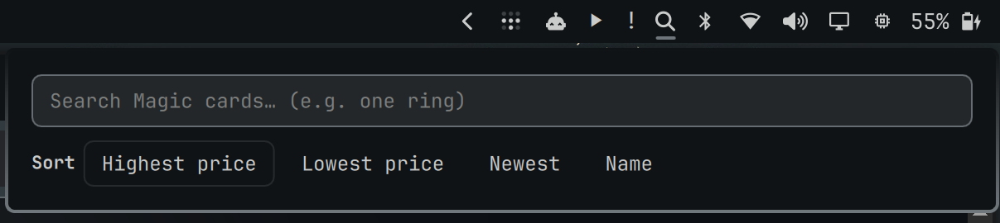
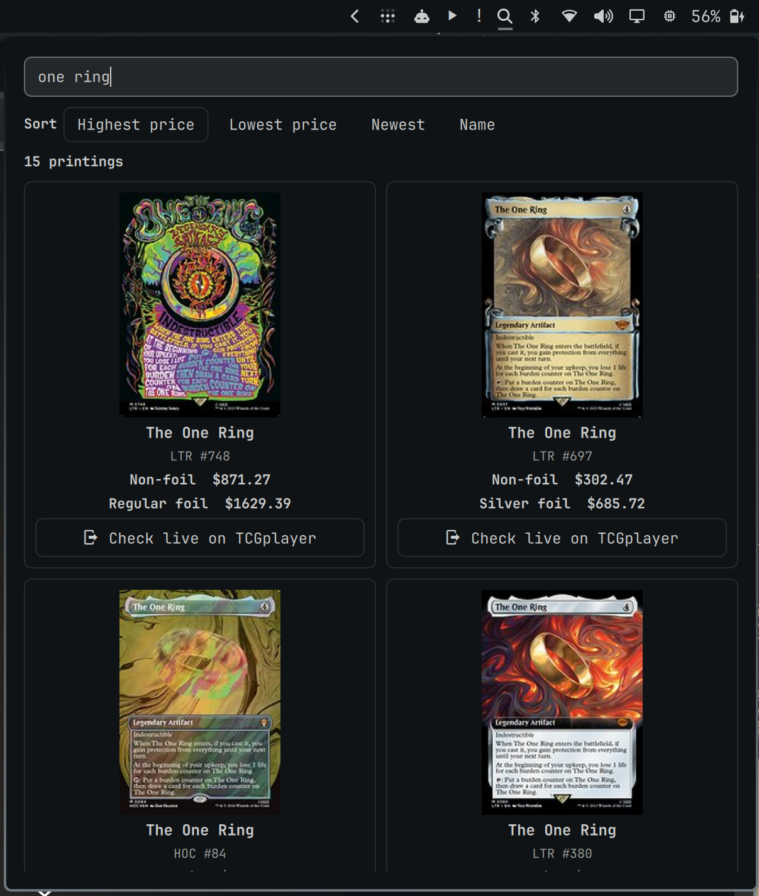
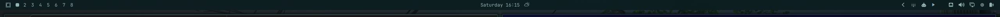
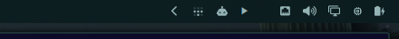
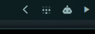

# tcg-player-plugin · wico216.tcg-player

An [Omarchy](https://omarchy.org/) shell plugin: a **Magic: The Gathering card search bar** for your status bar.

Click once and type a card name — e.g. *one ring*. The pane shows a large, two-column gallery of printings with the compact set code, collector number, and every available finish price. Special treatments such as surge, galaxy, textured, rainbow, and etched foil are labeled explicitly. Sort by highest price, lowest price, newest, or name, then jump directly to the live TCGplayer product page.

## Screenshots












## How prices work

TCGplayer has an API, but it is not granting new developer access. This plugin needs no TCGplayer credentials because the free [Scryfall API](https://scryfall.com/docs/api) already publishes TCGplayer retail ("market") prices per printing:

- `prices.usd` → TCGplayer non-foil price
- `prices.usd_foil` → TCGplayer foil price
- `purchase_uris.tcgplayer` → deep link to the product on TCGplayer

The plugin talks only to Scryfall, using debounced and serialized requests, and never scrapes TCGplayer. Prices are daily snapshots rather than live listings.

## Install

```bash
omarchy plugin add https://github.com/wico216/tcg-player-plugin.git --enable
omarchy bar move wico216.tcg-player --after omarchy.agents
```

Omarchy installs the plugin as a Git-managed checkout. Update it later with:

```bash
omarchy plugin update wico216.tcg-player
```

## Remove

```bash
omarchy plugin remove wico216.tcg-player
```

For local development, files under `~/.config/omarchy/plugins/` hot-reload on save. If a change fails to apply, run `omarchy-shell shell rescanPlugins`.

## Use

- Click the search icon once and start typing immediately (or use `omarchy-shell wico216.tcg-player open`)
- Type at least 2 characters; results debounce in as you type
- Sort the gallery by **Highest price**, **Lowest price**, **Newest**, or **Name**
- Price sorting uses the highest available non-foil, regular foil, special foil, or etched snapshot for each printing; unpriced printings stay last
- Each large card tile shows every available finish with its exact treatment label and Scryfall price snapshot
- **Check live on TCGplayer** launches that printing's current product page
- `Esc` closes the pane

## Files

| File            | Purpose                                          |
|-----------------|--------------------------------------------------|
| `manifest.json` | Plugin contract (`bar-widget`, id `wico216.tcg-player`) |
| `BarWidget.qml` | Native bar icon, focused search, and card gallery |
| `CardModel.js`  | Visible icon contract and deterministic result sorting |
| `tests/card-model.test.mjs` | Regression tests for the icon and sorting |

## Requirements

- Omarchy with `omarchy-shell` (Quickshell) running
- `curl` 8.20 or newer and `xdg-open`
- Network access to `api.scryfall.com`, `cards.scryfall.io`, and `www.tcgplayer.com`

## Test

```bash
node --test tests/card-model.test.mjs
omarchy plugin validate .
```

## Attribution and disclaimer

TCG Player Search is unofficial Fan Content permitted under the Wizards of the Coast Fan Content Policy. It is not approved or endorsed by Wizards. Portions of the materials used are property of Wizards of the Coast. ©Wizards of the Coast LLC.

This project is not affiliated with or endorsed by Scryfall or TCGplayer. Card data and images are provided at runtime by Scryfall. Magic: The Gathering, TCGplayer, Scryfall, and their respective marks and materials belong to their respective owners.

## License

The original source code in this repository is available under the [MIT License](LICENSE). The license does not grant rights to third-party names, trademarks, card data, or artwork.
